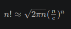

  ## Fakulteta 
   
   Fakulteta n
   je produkt prvih n
   naravnih števil:

   n!=1⋅2⋅3⋅…⋅(n−1)⋅n


   Za velika števila n
   si pri izračunu fakultete pogosto pomagamo s Stirlingovim približkom (ali Stirlingovo formulo):




1) Napišite metodi

   ``static long fakultetaL(int n);``

   ```static long stirlingL(int n);```


   ki izračunata in vrneta fakulteto števila n, prva po definiciji, druga po Stirlingovi formuli.

   Opomba: Ker je je izračunana vrednost Stirlingove formule realna, mora metoda stirlingL() vrniti vrednost, zaokroženo na celo število. Za to lahko        uporabimo metodo Math.round().


2) Napišite tudi metodo main(), v kateri izračunate in izpišete vrednosti obeh metod iz točke 1) za prvih 20 vrednosti števila n
   . Poleg tega izračunajte in izpišite tudi relativno napako Stirlingove formule. Izpis naj bo natanko tak:

```
 n              n!            Stirling(n)      napaka (%)
----------------------------------------------------------
  1                    1                    1   0.0000000
  2                    2                    2   0.0000000
  3                    6                    6   0.0000000
  4                   24                   24   0.0000000
  5                  120                  118   1.6666667
  6                  720                  710   1.3888889
  7                 5040                 4980   1.1904762
  8                40320                39902   1.0367063
  9               362880               359537   0.9212412
 10              3628800              3598696   0.8295855
 11             39916800             39615625   0.7545069
 12            479001600            475687486   0.6918795
 13           6227020800           6187239475   0.6388500
 14          87178291200          86661001741   0.5933696
 15        1307674368000        1300430722199   0.5539335
 16       20922789888000       20814114415223   0.5194120
 17      355687428096000      353948328666101   0.4889404
 18     6402373705728000     6372804626194313   0.4618456
 19   121645100408832000   121112786592294192   0.4375958
 20  2432902008176640000  2422786846761135104   0.4157653 
 ```


3) Ker vrednost fakultete z večanjem števila *n*
 zelo hitro narašča, bo podatkovni tip long kmalu premajhen. Ugotovite, do katere vrednosti n
 je ta tip še primeren za izračun vrednosti fakultete.

4) Napišite metodi

   ```static double fakultetaD(int n);```
   
   ```static double stirlingD(int n);```
   
   ki vračata rezultat tipa double. Pri tem ustrezno spremenite kodo obeh že napisanih metod.

 
5) Za prvih 100 vrednosti števila *n*
 izpišite tabelo z vrednostmi obeh metod in relativno napako. Izpis naj bo natanko tak, kot je prikazano.
 
 ``` 
 n         n!            Stirling(n)     napaka (%)
----------------------------------------------------
  1   1.000000000E+00   9.221370089E-01   7.7862991
  2   2.000000000E+00   1.919004351E+00   4.0497824
  3   6.000000000E+00   5.836209591E+00   2.7298401
  4   2.400000000E+01   2.350617513E+01   2.0576036
  5   1.200000000E+02   1.180191680E+02   1.6506934
  6   7.200000000E+02   7.100781846E+02   1.3780299
  7   5.040000000E+03   4.980395832E+03   1.1826224
  8   4.032000000E+04   3.990239545E+04   1.0357256
  9   3.628800000E+05   3.595368728E+05   0.9212762
 10   3.628800000E+06   3.598695619E+06   0.8295960
 11   3.991680000E+07   3.961562505E+07   0.7545067
 12   4.790016000E+08   4.756874865E+08   0.6918794
 13   6.227020800E+09   6.187239475E+09   0.6388500
 14   8.717829120E+10   8.666100174E+10   0.5933696
 15   1.307674368E+12   1.300430722E+12   0.5539335
 16   2.092278989E+13   2.081411442E+13   0.5194120
 17   3.556874281E+14   3.539483287E+14   0.4889404
 18   6.402373706E+15   6.372804626E+15   0.4618456
 19   1.216451004E+17   1.211127866E+17   0.4375958
 20   2.432902008E+18   2.422786847E+18   0.4157653
 21   5.109094217E+19   5.088861733E+19   0.3960092
 22   1.124000728E+21   1.119751495E+21   0.3780454
 23   2.585201674E+22   2.575852537E+22   0.3616405
 24   6.204484017E+23   6.182979270E+23   0.3466001
 25   1.551121004E+25   1.545959483E+25   0.3327607
 26   4.032914611E+26   4.020009931E+26   0.3199840
 27   1.088886945E+28   1.085531517E+28   0.3081521
 28   3.048883446E+29   3.039823262E+29   0.2971640
 29   8.841761994E+30   8.816392105E+30   0.2869325
 30   2.652528598E+32   2.645170959E+32   0.2773821
 31   8.222838654E+33   8.200764697E+33   0.2684469
 32   2.631308369E+35   2.624465141E+35   0.2600694
 33   8.683317619E+36   8.661418381E+36   0.2521990
 34   2.952327990E+38   2.945100961E+38   0.2447909
 35   1.033314797E+40   1.030857517E+40   0.2378056
 36   3.719933268E+41   3.711332491E+41   0.2312078
 37   1.376375309E+43   1.373278928E+43   0.2249663
 38   5.230226175E+44   5.218769212E+44   0.2190529
 39   2.039788208E+46   2.035434435E+46   0.2134424
 40   8.159152832E+47   8.142172645E+47   0.2081121
 41   3.345252661E+49   3.338460407E+49   0.2030416
 42   1.405006118E+51   1.402221224E+51   0.1982122
 43   6.041526306E+52   6.029829471E+52   0.1936073
 44   2.658271575E+54   2.653241821E+54   0.1892114
 45   1.196222209E+56   1.194009069E+56   0.1850108
 46   5.502622160E+57   5.492662822E+57   0.1809926
 47   2.586232415E+59   2.581651028E+59   0.1771452
 48   1.241391559E+61   1.239238266E+61   0.1734580
 49   6.082818640E+62   6.072482646E+62   0.1699211
 50   3.041409320E+64   3.036344594E+64   0.1665256
 51   1.551118753E+66   1.548586347E+66   0.1632632
 52   8.065817517E+67   8.052902038E+67   0.1601261
 53   4.274883284E+69   4.268167131E+69   0.1571073
 54   2.308436973E+71   2.304877359E+71   0.1542002
 55   1.269640335E+73   1.267718116E+73   0.1513988
 56   7.109985878E+74   7.099413523E+74   0.1486973
 57   4.052691950E+76   4.046771352E+76   0.1460905
 58   2.350561331E+78   2.347186546E+78   0.1435736
 59   1.386831185E+80   1.384873786E+80   0.1411419
 60   8.320987113E+81   8.309438315E+81   0.1387912
 61   5.075802139E+83   5.068872779E+83   0.1365175
 62   3.146997326E+85   3.142770369E+85   0.1343172
 63   1.982608315E+87   1.979987573E+87   0.1321866
 64   1.268869322E+89   1.267218237E+89   0.1301225
 65   8.247650592E+90   8.237083540E+90   0.1281220
 66   5.443449391E+92   5.436580738E+92   0.1261820
 67   3.647111092E+94   3.642577737E+94   0.1242999
 68   2.480035542E+96   2.476998167E+96   0.1224731
 69   1.711224524E+98   1.709159090E+98   0.1206992
 70  1.197857167E+100  1.196432005E+100   0.1189760
 71  8.504785886E+101  8.494809664E+101   0.1173013
 72  6.123445838E+103  6.116362662E+103   0.1156730
 73  4.470115462E+105  4.465015533E+105   0.1140894
 74  3.307885442E+107  3.304162465E+107   0.1125485
 75  2.480914081E+109  2.478159057E+109   0.1110487
 76  1.885494702E+111  1.883428418E+111   0.1095884
 77  1.451830920E+113  1.450260533E+113   0.1081660
 78  1.132428118E+115  1.131218911E+115   0.1067800
 79  8.946182131E+116  8.936750256E+116   0.1054291
 80  7.156945705E+118  7.149494473E+118   0.1041119
 81  5.797126021E+120  5.791164997E+120   0.1028272
 82  4.753643337E+122  4.748814876E+122   0.1015739
 83  3.945523970E+124  3.941564607E+124   0.1003507
 84  3.314240135E+126  3.310953844E+126   0.0991567
 85  2.817104114E+128  2.814343614E+128   0.0979907
 86  2.422709538E+130  2.420363099E+130   0.0968519
 87  2.107757298E+132  2.105739349E+132   0.0957392
 88  1.854826423E+134  1.853070797E+134   0.0946517
 89  1.650795516E+136  1.649250557E+136   0.0935887
 90  1.485715964E+138  1.484340944E+138   0.0925494
 91  1.352001528E+140  1.350764003E+140   0.0915328
 92  1.243841405E+142  1.242715252E+142   0.0905383
 93  1.156772507E+144  1.155736441E+144   0.0895653
 94  1.087366157E+146  1.086402610E+146   0.0886129
 95  1.032997849E+148  1.032092111E+148   0.0876805
 96  9.916779349E+149  9.908174800E+149   0.0867676
 97  9.619275968E+151  9.611015564E+151   0.0858735
 98  9.426890449E+153  9.418877821E+153   0.0849976
 99  9.332621544E+155  9.324769134E+155   0.0841394
100  9.332621544E+157  9.324847625E+157   0.0832983
```

   Kaj lahko rečete o relativni napaki Stirlingove formule?


## Dodatni izzivi

Napišite metodo izracunajPi(k), ki izračuna π s pomočjo verižnih ulomkov za prvih k členov in vrne približek π kot rezultat.

Napišite še metodo izracunajPiRekurzivno(k), ki deluje enako kot metoda izracunajPi(k), le da izračun izvede rekurzivno.

Tabelirajte tudi izračun π s pomočjo verižnih ulomkov (z uporabo iterativne in rekurzivne metode za izračun približka). Izpišite približke za vse k od 1 do 22, zraven pa pripišite tudi razliko med izračunano vrednostjo in vrednostjo Math.PI, kot je prikazano spodaj.


```  k     Math.PI             PI (rekurzivno)     PI (iterativno)      razlika 
-------------------------------------------------------------------------------------
  1   3.141592653589793   4.000000000000000   4.000000000000000   -0.858407346410207
  2   3.141592653589793   3.000000000000000   3.000000000000000   +0.141592653589793
  3   3.141592653589793   3.166666666666667   3.166666666666667   -0.025074013076874
  4   3.141592653589793   3.137254901960785   3.137254901960785   +0.004337751629008
  5   3.141592653589793   3.142342342342342   3.142342342342342   -0.000749688752549
  6   3.141592653589793   3.141463414634146   3.141463414634146   +0.000129238955647
  7   3.141592653589793   3.141614906832298   3.141614906832298   -0.000022253242505
  8   3.141592653589793   3.141588825092124   3.141588825092124   +0.000003828497669
  9   3.141592653589793   3.141593311879928   3.141593311879928   -0.000000658290135
 10   3.141592653589793   3.141592540446540   3.141592540446540   +0.000000113143253
 11   3.141592653589793   3.141592673030334   3.141592673030334   -0.000000019440541
 12   3.141592653589793   3.141592650250245   3.141592650250245   +0.000000003339548
 13   3.141592653589793   3.141592654163366   3.141592654163366   -0.000000000573573
 14   3.141592653589793   3.141592653491296   3.141592653491296   +0.000000000098498
 15   3.141592653589793   3.141592653606706   3.141592653606706   -0.000000000016913
 16   3.141592653589793   3.141592653586889   3.141592653586889   +0.000000000002904
 17   3.141592653589793   3.141592653590292   3.141592653590292   -0.000000000000499
 18   3.141592653589793   3.141592653589707   3.141592653589707   +0.000000000000086
 19   3.141592653589793   3.141592653589808   3.141592653589808   -0.000000000000015
 20   3.141592653589793   3.141592653589791   3.141592653589791   +0.000000000000002
 21   3.141592653589793   3.141592653589794   3.141592653589794   -0.000000000000000
 22   3.141592653589793   3.141592653589793   3.141592653589793   +0.000000000000000
```
